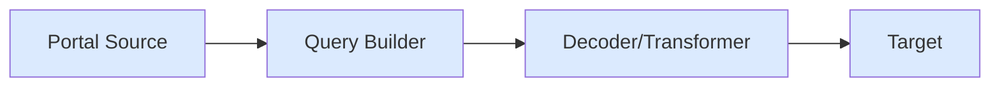

Pipes SDK provides a streaming architecture for indexing Solana blockchain data. Data flows through a pipeline of components that fetch, transform, and persist blockchain data.

## Architecture



## Components

### Portal Source

The `solanaPortalSource` connects to Subsquid Portal API and streams Solana blockchain data.

```ts
import { solanaPortalSource } from '@subsquid/pipes/solana'

const source = solanaPortalSource({
  portal: 'https://portal.sqd.dev/datasets/solana-mainnet',
  query: queryBuilder,
})
```

### Query Builder

The `SolanaQueryBuilder` defines what data to fetch from the Portal. It supports:

- **Field selection**: Choose which block, transaction, and instruction fields to include
- **Data filtering**: Filter by program ID, instruction discriminators, account addresses
- **Range specification**: Define slot ranges for data fetching

```ts
import { SolanaQueryBuilder } from '@subsquid/pipes/solana'

const queryBuilder = new SolanaQueryBuilder()
  .addFields({
    block: { slot: true, hash: true },
    instruction: { programId: true, data: true, accounts: true },
  })
  .addInstruction({
    request: { programId: ['...'] },
    range: { from: 200000000 },
  })
```

### Decoders & Transformers

**Decoders** parse raw instruction data into typed objects using ABIs:

```ts
import { solanaInstructionDecoder } from '@subsquid/pipes/solana'

const decoder = solanaInstructionDecoder({
  programId: orcaWhirlpool.programId,
  instructions: { swap: orcaWhirlpool.instructions.swap },
  range: { from: 200000000 },
})
```

**Transformers** reshape data as it flows through the pipeline:

```ts
import { createTransformer } from '@subsquid/pipes'

const transformer = createTransformer({
  transform: async (data) => {
    return data.blocks.map(b => ({
      slot: b.header.slot,
      instructionCount: b.instructions.length,
    }))
  },
})
```

### Targets

Targets persist or output the processed data:

```ts
import { createTarget } from '@subsquid/pipes'

const target = createTarget({
  write: async ({ logger, read }) => {
    for await (const { data } of read()) {
      await database.insert(data)
    }
  },
})
```

## Data Flow

1. **Source** connects to Portal and streams raw blockchain data
2. **Query Builder** filters and shapes the Portal query
3. **Decoder/Transformer** processes and transforms the data
4. **Target** persists or outputs the final data

## Pipeline Composition

Chain components using `.pipe()` and `.pipeTo()`:

```ts
await source
  .pipe(decoder)
  .pipe(transformer)
  .pipeTo(target)
```

Use `.pipeComposite()` for parallel processing:

```ts
await source
  .pipeComposite({
    orcaSwaps: solanaInstructionDecoder({ ... }),
    raydiumSwaps: solanaInstructionDecoder({ ... }),
  })
  .pipeTo(target)
```

## Key Concepts

| Concept | Description |
|---------|-------------|
| **Slot** | Solana's equivalent of a block number |
| **Instruction** | A single operation within a transaction |
| **Discriminator** | Unique identifier for instruction types (d1, d2, d4, d8 byte prefixes) |
| **Program ID** | Address of the Solana program (smart contract) |
| **Cursor** | Tracks indexing progress for resumption |
| **Fork handling** | Manages blockchain reorganizations |

## Next Steps

- [Sources & Query Builder](/en/sdk/pipes-sdk/solana/core-concepts/sources-query-builder) - Learn how to configure data sources
- [Instruction Decoder](/en/sdk/pipes-sdk/solana/core-concepts/decoders) - Decode program instructions
- [Transformers](/en/sdk/pipes-sdk/solana/core-concepts/transformers) - Transform and process data
- [Targets & Persistence](/en/sdk/pipes-sdk/solana/core-concepts/targets-persistence) - Persist data to databases
