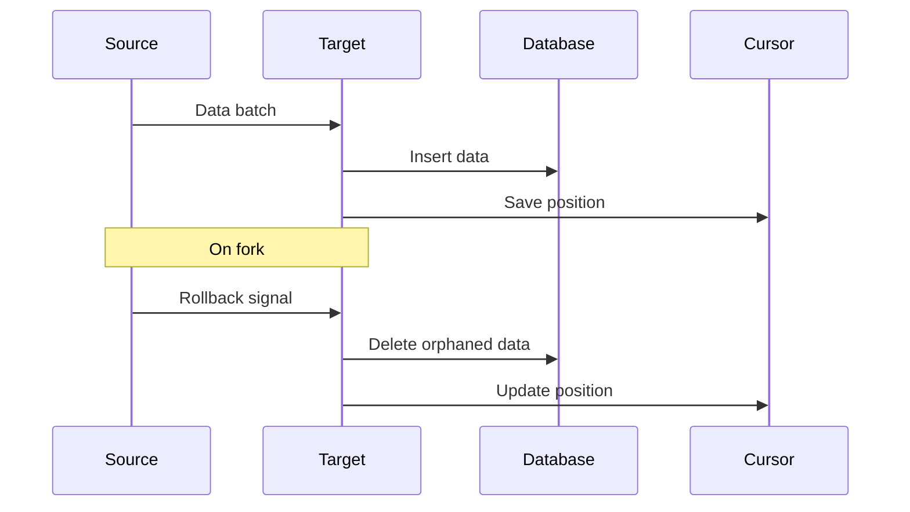

Targets are the final component in a pipe, responsible for persisting or outputting processed data.

## createTarget

The `createTarget` function creates a custom target for data persistence:

```ts
import { createTarget } from '@subsquid/pipes'

const target = createTarget({
  write: async ({ logger, read }) => {
    for await (const { data } of read()) {
      await database.insert(data)
      logger.info(`Processed ${data.length} items`)
    }
  },
})

await source.pipe(decoder).pipeTo(target)
```

### Write Function

The `write` function receives a context object with:

| Property | Description |
|----------|-------------|
| `logger` | Pino-compatible logger instance |
| `read` | Async iterator that yields data batches |

Each batch from `read()` contains:

```ts
{
  data: any,           // The processed data
  ctx: {
    profiler: Profiler, // Performance profiling
    logger: Logger,     // Logger instance
  }
}
```

## Cursor Management

Save indexing progress to resume after restarts:

```ts
import fs from 'fs/promises'

const CURSOR_FILE = 'cursor.json'

async function loadCursor() {
  try {
    const data = await fs.readFile(CURSOR_FILE, 'utf-8')
    return JSON.parse(data)
  } catch {
    return null
  }
}

async function saveCursor(slotNumber: number) {
  await fs.writeFile(CURSOR_FILE, JSON.stringify({ slotNumber }))
}

// Load cursor and configure source
const cursor = await loadCursor()

const source = solanaPortalSource({
  portal: 'https://portal.sqd.dev/datasets/solana-mainnet',
  cursor: cursor ? { number: cursor.slotNumber } : undefined,
})

const target = createTarget({
  write: async ({ logger, read }) => {
    for await (const { data } of read()) {
      await database.insert(data.swap)

      // Save progress
      const lastSlot = Math.max(...data.swap.map(s => s.blockNumber))
      await saveCursor(lastSlot)

      logger.info(`Processed up to slot ${lastSlot}`)
    }
  },
})
```

## Fork Handling

Solana can experience chain reorganizations. Handle them with the `onRollback` callback:

```ts
const target = createTarget({
  write: async ({ logger, read }) => {
    for await (const { data } of read()) {
      await database.insert(data.swap)
    }
  },
  onRollback: async ({ cursor }) => {
    console.log(`Fork detected at slot ${cursor.number}`)

    // Delete data after the fork point
    await database.query(
      'DELETE FROM swaps WHERE slot_number > $1',
      [cursor.number]
    )
  },
})
```

### Using Finalized Blocks

To avoid fork handling entirely, use finalized blocks:

```ts
const source = solanaPortalSource({
  portal: {
    url: 'https://portal.sqd.dev/datasets/solana-mainnet',
    finalized: true,
  },
  query: queryBuilder,
})
```

<Tip>
Using finalized blocks eliminates the need for `onRollback` handlers, simplifying your target implementation.
</Tip>

## Built-in Targets

### ClickHouse Target

For production workloads, use the ClickHouse target with automatic fork handling:

```ts
import { createClient } from '@clickhouse/client'
import { clickhouseTarget } from '@subsquid/pipes/targets/clickhouse'

const client = createClient({
  url: 'http://localhost:8123',
  username: 'default',
  password: 'default',
})

// Create table with CollapsingMergeTree for fork handling
await client.command({
  query: `
    CREATE TABLE IF NOT EXISTS swaps (
      slot_number UInt64 CODEC(DoubleDelta, ZSTD),
      timestamp DateTime CODEC(DoubleDelta, ZSTD),
      transaction_hash String,
      program_id String,
      sign Int8 DEFAULT 1
    )
    ENGINE = CollapsingMergeTree(sign)
    ORDER BY (slot_number, transaction_hash)
  `,
})

const target = clickhouseTarget({
  client,
  onData: async ({ store, data, ctx }) => {
    store.insert({
      table: 'swaps',
      values: data.swap.map(s => ({
        slot_number: s.blockNumber,
        timestamp: s.timestamp.valueOf() / 1000,
        transaction_hash: s.transaction.signatures[0],
        program_id: s.programId,
      })),
      format: 'JSONEachRow',
    })
  },
  onRollback: async ({ store, safeCursor }) => {
    await store.removeAllRows({
      tables: ['swaps'],
      where: `slot_number > ${safeCursor.number}`,
    })
  },
})
```

## Output Patterns

### Console Logging

```ts
const target = createTarget({
  write: async ({ read }) => {
    for await (const { data } of read()) {
      console.log(JSON.stringify(data, null, 2))
    }
  },
})
```

### File Output

```ts
import fs from 'fs/promises'

const target = createTarget({
  write: async ({ logger, read }) => {
    for await (const { data } of read()) {
      const filename = `data-${Date.now()}.json`
      await fs.writeFile(filename, JSON.stringify(data, null, 2))
      logger.info(`Saved to ${filename}`)
    }
  },
})
```

### Database Insert

```ts
const target = createTarget({
  write: async ({ read }) => {
    for await (const { data } of read()) {
      await database.transaction(async (tx) => {
        for (const swap of data.swap) {
          await tx.insert('swaps', {
            slot_number: swap.blockNumber,
            tx_hash: swap.transaction.signatures[0],
            program_id: swap.programId,
            timestamp: swap.timestamp,
          })
        }
      })
    }
  },
})
```

## Data Flow



## Best Practices

1. **Always save cursors** - Enables resumption after restarts
2. **Handle forks** - Implement `onRollback` or use finalized blocks
3. **Use transactions** - Wrap database operations in transactions for consistency
4. **Log progress** - Use the provided logger to track indexing progress
5. **Profile performance** - Use the profiler to identify bottlenecks

```ts
const target = createTarget({
  write: async ({ logger, read }) => {
    for await (const { data, ctx } of read()) {
      const span = ctx.profiler.start('database-insert')

      await database.transaction(async (tx) => {
        await tx.insert('swaps', data.swap)
      })

      span.end()
      logger.info(`Inserted ${data.swap.length} swaps`)
    }
  },
})
```
