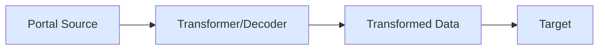

Learn how to transform and process Solana data as it flows through your pipes.

## Basic Pipe

Create a source and target to stream raw Solana blockchain data.

```ts
import { createTarget } from '@subsquid/pipes'
import { solanaPortalSource, SolanaQueryBuilder } from '@subsquid/pipes/solana'

// Build a query that requests swap instructions from Orca Whirlpool
const queryBuilder = new SolanaQueryBuilder()
  .addFields({
    block: {
      slot: true, hash: true,
    },
    instruction: {
      programId: true,
      data: true,
      accounts: true,
      transactionHash: true,
    },
  })
  .addInstruction({
    request: {
      programId: ['whirLbMiicVdio4qvUfM5KAg6Ct8VwpYzGff3uctyCc'], // Orca Whirlpool
      d8: ['0xf8c69e91e17587c8'], // Swap instruction discriminator
    },
    range: {
      from: 200000000,
      to: 200000000,
    },
  })

async function main() {
  const source = solanaPortalSource({
    portal: 'https://portal.sqd.dev/datasets/solana-mainnet',
    query: queryBuilder,
  })

  const target = createTarget({
    write: async ({logger, read}) => {
      for await (const {data} of read()) {
        logger.info(data, 'data')
      }
    },
  })

  await source.pipeTo(target)
}

void main()
```

The query builder shapes the query sent to the Portal API. All methods only add to the data request. Block `slot` and `hash` fields are required.

## createTransformer

Transform data between source and target using `createTransformer`.

```ts
import { createTarget, createTransformer } from '@subsquid/pipes'
import {
  solanaPortalSource,
  type SolanaPortalData,
  SolanaQueryBuilder
} from '@subsquid/pipes/solana'

const queryBuilder = new SolanaQueryBuilder()
  .addFields({
    block: {
      slot: true, hash: true,
    },
    instruction: {
      programId: true,
      data: true,
      accounts: true,
      transactionHash: true,
    },
  })
  .addInstruction({
    request: {
      programId: ['whirLbMiicVdio4qvUfM5KAg6Ct8VwpYzGff3uctyCc'], // Orca Whirlpool
      d8: ['0xf8c69e91e17587c8'], // Swap instruction discriminator
    },
    range: {
      from: 200000000,
      to: 200000000,
    },
  })

async function main() {
  const source = solanaPortalSource({
    portal: 'https://portal.sqd.dev/datasets/solana-mainnet',
    query: queryBuilder,
  })

  // Extract transaction hashes from instructions
  const transformer = createTransformer({
    transform: async (data: SolanaPortalData<any>) => {
      return data.blocks.map(b => b.instructions.map(i => i.transactionHash))
    }
  })

  const target = createTarget({
    write: async ({logger, read}) => {
      for await (const {data} of read()) {
        logger.info({data}, 'data')
      }
    },
  })

  await source.pipe(transformer).pipeTo(target)
}

void main()
```

The transformer converts block and instruction data into an array of transaction hashes.

## Query from Transformer

Build queries dynamically within transformers using the `query` callback.

```ts
import { createTarget, createTransformer } from '@subsquid/pipes'
import {
  solanaPortalSource,
  type SolanaPortalData,
  SolanaQueryBuilder
} from '@subsquid/pipes/solana'

async function main() {
  const blankQueryBuilder = new SolanaQueryBuilder()

  const source = solanaPortalSource({
    portal: 'https://portal.sqd.dev/datasets/solana-mainnet',
    query: blankQueryBuilder,
  })

  // Build the query inside the transformer
  const transformer = createTransformer({
    transform: async (data: SolanaPortalData<any>) => {
      return data.blocks.map(b => b.instructions.map(i => i.transactionHash))
    },
    query: ({queryBuilder, portal, logger}) => {
      queryBuilder.addFields({
        block: {
          slot: true, hash: true,
        },
        instruction: {
          programId: true,
          data: true,
          accounts: true,
          transactionHash: true,
        },
      })
      .addInstruction({
        request: {
          programId: ['whirLbMiicVdio4qvUfM5KAg6Ct8VwpYzGff3uctyCc'], // Orca Whirlpool
          d8: ['0xf8c69e91e17587c8'], // Swap instruction discriminator
        },
        range: {
          from: 200000000,
          to: 200000000,
        },
      })
    }
  })

  const target = createTarget({
    write: async ({logger, read}) => {
      for await (const {data} of read()) {
        logger.info({data}, 'data')
      }
    },
  })

  await source.pipe(transformer).pipeTo(target)
}

void main()
```

Use the `query` callback to add filters dynamically based on runtime conditions.

## Instruction Decoder

The `solanaInstructionDecoder` automatically handles query building and instruction decoding.

```ts
import { createTarget } from '@subsquid/pipes'
import { solanaPortalSource, solanaInstructionDecoder } from '@subsquid/pipes/solana'
import * as orcaWhirlpool from './abi/orca_whirlpool/index.js'

async function main() {
  const source = solanaPortalSource({
    portal: 'https://portal.sqd.dev/datasets/solana-mainnet'
    // Query builder is optional, decoder adds one automatically
  })

  const decoder = solanaInstructionDecoder({
    programId: orcaWhirlpool.programId,
    instructions: {
      swap: orcaWhirlpool.instructions.swap,
      swapV2: orcaWhirlpool.instructions.swapV2,
    },
    range: { from: 200_000_000, to: 200_000_000 }
  })

  const target = createTarget({
    write: async ({logger, read}) => {
      for await (const {data} of read()) {
        // data.swap and data.swapV2 contain decoded swap instructions
        logger.info({data}, 'data')
      }
    },
  })

  await source.pipe(decoder).pipeTo(target)
}

void main()
```

Each decoded instruction includes `blockNumber`, `timestamp`, `programId`, `transaction`, and the decoded `instruction` fields.

## Composite Pipes

Process multiple data streams simultaneously using `pipeComposite`.

```ts
import { createTarget } from '@subsquid/pipes'
import {
  solanaPortalSource,
  solanaInstructionDecoder,
} from '@subsquid/pipes/solana'
import * as orcaWhirlpool from './abi/orca_whirlpool/index.js'
import * as raydiumAmm from './abi/raydium-amm/index.js'

const atSlot = 200000000
const oneSlotRange = { from: atSlot, to: atSlot }

async function main() {
  const source = solanaPortalSource({
    portal: 'https://portal.sqd.dev/datasets/solana-mainnet',
  })

  const target = createTarget({
    write: async ({logger, read}) => {
      for await (const {data} of read()) {
        // Access data from both decoders
        logger.info({
          orcaSwaps: data.orcaSwaps.swap.length + data.orcaSwaps.swapV2.length,
          raydiumSwaps: data.raydiumSwaps.swapBaseIn.length + data.raydiumSwaps.swapBaseOut.length
        }, 'data')
      }
    },
  })

  await source
    .pipeComposite({
      orcaSwaps: solanaInstructionDecoder({
        programId: orcaWhirlpool.programId,
        instructions: {
          swap: orcaWhirlpool.instructions.swap,
          swapV2: orcaWhirlpool.instructions.swapV2,
        },
        range: oneSlotRange
      }),
      raydiumSwaps: solanaInstructionDecoder({
        programId: raydiumAmm.programId,
        instructions: {
          swapBaseIn: raydiumAmm.instructions.swapBaseIn,
          swapBaseOut: raydiumAmm.instructions.swapBaseOut,
        },
        range: oneSlotRange
      })
    })
    .pipeTo(target)
}

void main()
```

Use `pipeComposite` to run multiple decoders in parallel. The data structure contains results from all decoders under their respective keys.

## Data Flow


