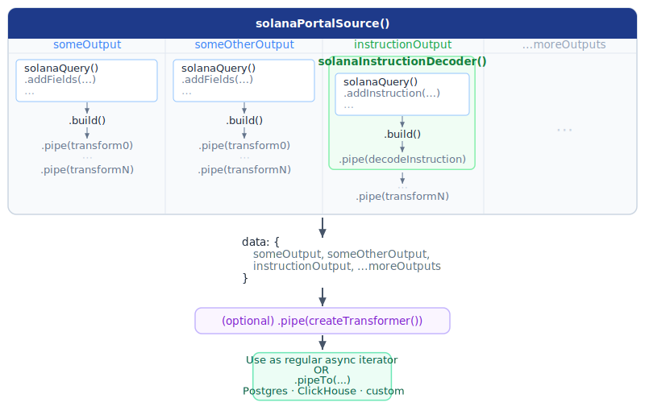

<Frame>
  </img>
</Frame>

A Solana pipe made with SQD's Pipes SDK consists of:
 - A **source** - typically made with `solanaPortalSource()`. Can have one or more outputs.
 - **Queries** - tell the source which data has to be retrieved to compute each output. A query is defined by a chain call terminated by `.build()`. Here's an example:


   ```ts
   solanaQuery()
     .addFields({
       block: { timestamp: true },
       instruction: { programId: true, transactionIndex: true },
     })
     .addInstruction({
       programId: [ ORCA_WHIRLPOOL_PROGRAM_ID ]
     })
     .build()
   ```

 - **Per-query transforms** (optional) - you can pass data from each query through a chain of simple transforms:
   ```ts
   query
     .pipe(data => data.map(item => ({
       funkyNumber: item.header.timestamp + item.header.number,
       ...item
     })))
     .pipe(someOtherSimpleTransformCallback)
   ```
   Source object streams the data you get out of each chain of transforms as the value of the corresponding output field.
 - Making utils that return reusable **query-transform combos** is a very useful pattern. In particular, on Solana it is often convenient to keep retrieval and decoding of program instructions in a single module. You can easily make such combos with the `solanaInstructionDecoder()` function - see the [Handling instructions](./handling-instructions) guide.
 - **Whole pipe transformers** (optional) - use this if you need to compute something based on data originating from multiple queries, or if you need access to per-batch context (cursor, logger, profiler, fork callbacks). Use `createTransformer()` so the SDK can thread cursor and rollback information ([1](../architecture-deep-dives/cursor-management), [2](../architecture-deep-dives/fork-handling)) through your transform:
   ```ts
   import { createTransformer } from '@subsquid/pipes'

   const enrichSwaps = createTransformer<
     { swaps: Swap[]; swapsV2: SwapV2[] },
     { events: EnrichedSwap[] }
   >({
     transform: ({ swaps, swapsV2 }, ctx) => {
       ctx.logger.info({ batch: ctx.stream.state.current?.number }, 'enriching')
       return {
         events: [
           ...swaps.map((s) => ({ version: 'v1' as const, ...s })),
           ...swapsV2.map((s) => ({ version: 'v2' as const, ...s })),
         ],
       }
     },
   })

   solanaPortalStream({ /* ... */ }).pipe(enrichSwaps)
   ```

 - Pipe termination: a plain async iterator or a **target**.
    * If you use the pipe as an async iterator it will throw exceptions if the underlying chain is experiencing reorgs, see [Fork handling](../architecture-deep-dives/fork-handling).
    * We offer two targets out of the box:
       - Postgres via Drizzle
       - ClickHouse

      You can make your own using [`createTarget()`](../../reference/basic-components/target/create-target).